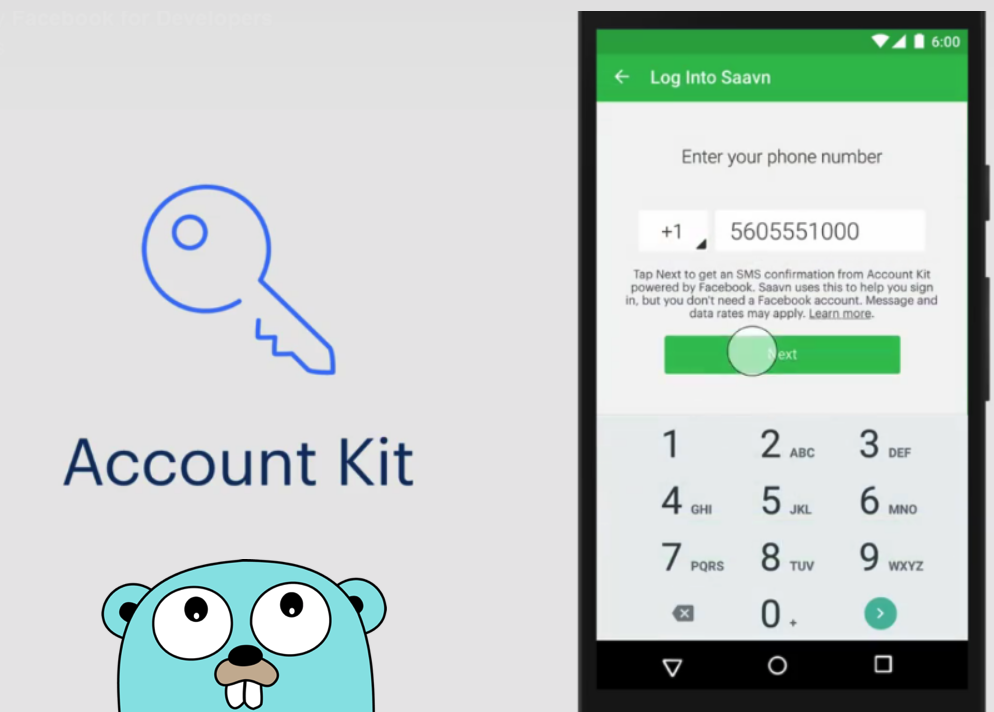
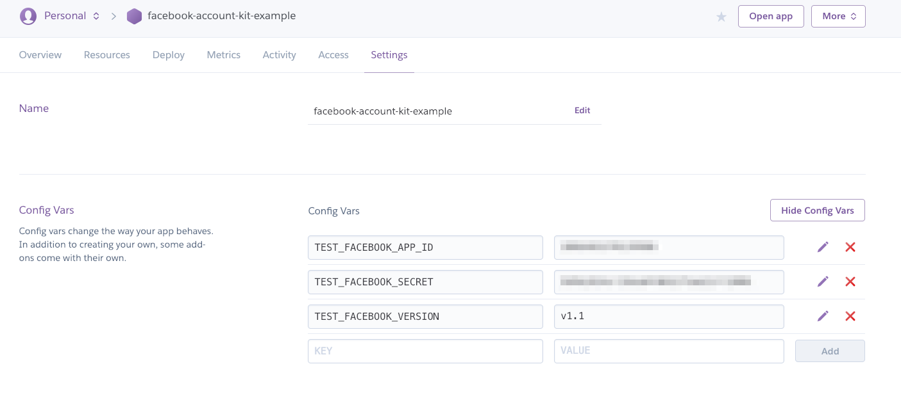
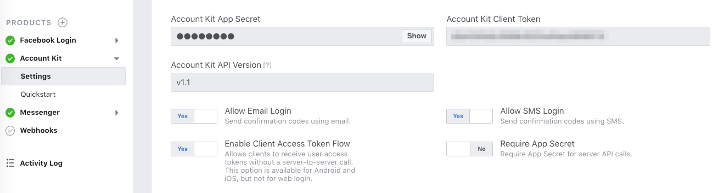

# facebook-account-kit



[](https://cloud.drone.io/go-training/facebook-account-kit)

Account Kit for Web (Golang), see the [demo site](https://facebook-account-kit-example.herokuapp.com/).

## Setup facebook account kit information

copy the `.env.example` to `.env`

```
TEST_FACEBOOK_APP_ID=xxxxxxxxx
TEST_FACEBOOK_SECRET=xxxxxxxxx
TEST_FACEBOOK_VERSION=v1.1
```

change the `app_id` and `secret value`.

## Run the app in go v1.11 version

Please make sure the go version in v1.11 using [go module](https://github.com/golang/go/wiki/Modules).

```sh
$ go run main.go
```


### Heroku

Click on the Heroku button to easily deploy your app:

[](https://heroku.com/deploy)

Or alternatively you can follow the manual steps:

Clone this repository:

```
$ git clone https://github.com/go-training/facebook-account-kit.git
```

Set the buildpack for your application

```
$ heroku config:add BUILDPACK_URL=https://github.com/go-training/facebook-account-kit.git
```

Add Heroku git remote:

```
$ heroku git:remote -a your-application
```

Deploy it!

```
$ git push heroku master
```

View the logs. For more information, see [View logs](https://devcenter.heroku.com/articles/logging#view-logs).

```
$ heroku logs --app {Heroku app name} --tail
```

Add Config Vars in dashboard.



You can refer the [facebook developer dashboard](https://developers.facebook.com/apps/).


